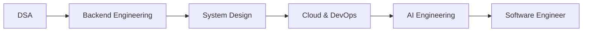

<!-- ===================== HEADER ===================== -->

<div align="center">


<br>

<a href="https://github.com/DeepanB2005">

</a>

<br><br>


<a href="https://github.com/DeepanB2005?tab=followers">

</a>

<a href="https://github.com/DeepanB2005?tab=repositories">

</a>

</div>

---

<!-- ===================== ABOUT ===================== -->

## 👨‍💻 About Me


I am **Deepan B**, a **B.Tech Artificial Intelligence & Data Science student at Kongu Engineering College**, focused on building practical software systems that combine **AI, backend engineering, and modern web technologies**.

```yaml
Name: Deepan B
Education: B.Tech AI & Data Science
College: Kongu Engineering College
CGPA: 7.84
Focus:
  - Full-Stack Development
  - Artificial Intelligence
  - Machine Learning
  - Backend Engineering
  - Data Structures & Algorithms
Current Role: Placement Coordinator
```

### 🔭 Currently

* 🧠 Strengthening **Data Structures & Algorithms**
* 🤖 Building practical **AI/ML systems**
* 🌐 Developing scalable **MERN applications**
* ☁️ Exploring **Docker, Kubernetes & Cloud**
* 🔐 Learning secure API architecture with **JWT & OAuth**
* 🚀 Preparing for software engineering opportunities

<br clear="right"/>

---

## 🧩 Tech Stack

### 💻 Programming

<p>

</p>

### 🌐 Frontend

<p>

</p>

### ⚙️ Backend & Databases

<p>

</p>

### ☁️ Cloud, DevOps & Tools

<p>

</p>

### 🤖 AI / ML

<p>


</p>

---

# 🚀 Featured Projects

<table>
<tr>
<td width="50%">

### 💼 Embedding Based Job Portal

**MERN • Sentence Transformers • Docker • Kubernetes**

A full-stack job platform with semantic matching between resumes and job descriptions.

**Key Features**

* 🔎 Semantic job matching
* 📄 Resume parsing
* 🤖 AI-powered recommendations
* 👨‍💼 Recruiter workflows
* 🧑‍💻 Freelancer services
* 🐳 Docker containerization
* ☸️ Kubernetes deployment

</td>

<td width="50%">

### 🔬 CNC Machine Inspection AI

**YOLO • OpenCV • FastAPI • React**

AI-powered industrial inspection system designed to identify defects and validate CNC component dimensions against tolerance limits.

**Key Features**

* 👁️ Computer vision inspection
* 🎯 YOLO-based detection
* 📏 Dimensional measurement
* ⚙️ Automated tolerance validation
* 🧪 Synthetic dataset generation
* ⚡ FastAPI backend

</td>
</tr>

<tr>
<td width="50%">

### 🏫 College Clubs & Event Management

**MERN • Capacitor • JWT**

A complete platform for managing college clubs, events, and student registrations.

**Key Features**

* 🔐 JWT authentication
* 👥 Role-based access control
* 📅 Event management
* 📝 Student registration
* 📱 Android application
* ⚡ MERN architecture

</td>

<td width="50%">

### 🧬 Genomic Surveillance

**AI • NLP • Genomics**

An AI-driven genomic surveillance platform developed during hackathon work to analyze genomic information and support disease-transmission intelligence.

🏆 **Hackvotrix Hackathon Winner — 2025**

</td>
</tr>
</table>

---

# 💼 Experience

### 🏢 Chain Aim Technology — USA 🇺🇸

**Software Developer Intern | July 2025 – March 2026**

* Developed reusable **React.js components** for a scalable technical documentation platform.
* Worked on a **Mina-based Zero-Knowledge Proof verification system**.
* Integrated frontend applications with backend **REST APIs**.
* Built a **Docusaurus developer portal**.
* Improved documentation accessibility and reduced documentation search time by **40%**.

---

### 🤖 SystimaNX IT Solutions Pvt Ltd

**Generative AI Developer Intern | November 2024 – February 2025**

* Preprocessed large-scale text datasets.
* Applied **tokenization, normalization, and lemmatization**.
* Built feature extraction pipelines using **TF-IDF and transformer embeddings**.
* Prepared datasets for transformer fine-tuning using the **Hugging Face ecosystem**.

---

# 🏆 Achievements

<div align="center">

| 🏅 Achievement                                                     |        📅 Year |
| ------------------------------------------------------------------ | -------------: |
| 🥇 Winner — Electrothon 24-Hour Hackathon                          |           2026 |
| 🥇 Winner — Hackvotrix Hackathon                                   |           2025 |
| 🥈 Runner-up — HackSphere 24-Hour Hackathon                        |           2026 |
| 🥇 First Prize — TechNo Task Front-End Web Development Competition |           2025 |
| 🎯 Placement Coordinator — Department of AI                        | 2025 – Present |

</div>

---

# 📜 Certifications

<p align="center">


</p>

---

# 📊 GitHub Analytics

<div align="center">


</div>

<br>

<div align="center">


</div>

<br>

<div align="center">


</div>

---

# 🐍 Contribution Animation

<div align="center">


</div>

---

# 📈 Coding Journey

```text
Data Structures & Algorithms     ███████████████░░░░░  75%
Java                             ████████████████░░░░  80%
Python                           ███████████████░░░░░  75%
JavaScript                       ████████████████░░░░  80%
React                            ███████████████░░░░░  75%
Node.js / Express                ██████████████░░░░░░  70%
Machine Learning                 █████████████░░░░░░░  65%
Docker / Kubernetes              ███████████░░░░░░░░░  55%
System Design                    ██████████░░░░░░░░░░  50%
```

> ⚡ These are personal learning-progress indicators, not benchmark scores.

---

# 🎯 2026 Focus

<div align="center">



</div>

### My Current Priorities

* 🧠 Advanced DSA & problem solving
* ⚙️ Scalable backend architecture
* 🏗️ System design fundamentals
* ☁️ Cloud deployment & DevOps
* 🤖 Production-oriented AI systems
* 🔐 Secure API development
* 🚀 Building projects with real-world impact

---

# 🎓 Education

### Kongu Engineering College

**B.Tech — Artificial Intelligence & Data Science**

📅 2024 – 2027
📊 **CGPA: 7.84**

### Kongu Polytechnic College

**Diploma — Communication & Computer Networking**

📅 2022 – 2024
📊 **91.22%**

---

# 🌐 Connect With Me

<div align="center">

<a href="mailto:deepanb2005@gmail.com">

</a>

<a href="https://www.linkedin.com/in/deepanb0202">

</a>

<a href="https://github.com/DeepanB2005">

</a>

<a href="https://leetcode.com/u/B_Deepan/">

</a>

</div>

<br>

<div align="center">

📧 **[deepanb2005@gmail.com](mailto:deepanb2005@gmail.com)**

📞 **9344681720**

</div>

---

<div align="center">

### 💡 "Build. Break. Learn. Improve."

<br>


</div>
